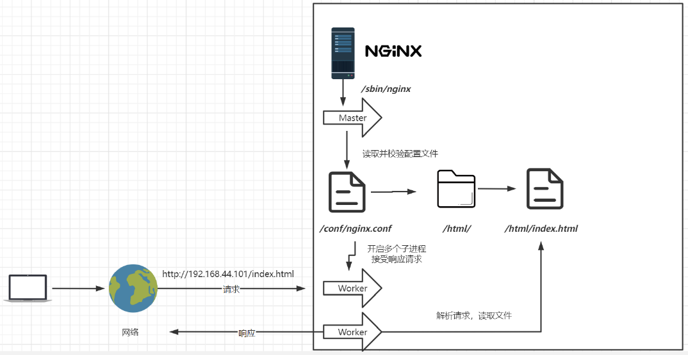

# 概述

## 1 安装

### 1.1 常用版本

- Nginx开源版：http://nginx.org/

  - WEB反向代理
  - 负载均衡

  > 纯净版，没有其他什么功能了，很多都需要自己开发，难度较大

- Nginx plus 商业版：https://www.nginx.com

- OpenResty（免费开源）：http://openresty.org

  - 以Lua脚本的形式扩展了Nginx

- Tengine（免费开源）：http://tengine.taobao.org/

  - 以C语言的形式扩展了Nginx

### 1.2 下载与安装

> 源码安装方式

1. 下载压缩包`nginx-1.21.6.tar.gz`上传到虚拟机
2. 安装必要软件：
   - `yum install -y gcc`
   - `yum install -y pcre pcre-devel`
   - `yum install -y zlib zlib-devel`
3. 配置：`./configure --prefix=/usr/local/nginx`
4. 编译、安装
   1. `make`
   2. `make install`

### 1.3 启动

进入`/usr/local/nginx/sbin`目录，`./nginx`运行

如果访问不了，可能是防火墙的问题：

- 关闭防火墙：`systemctl stop firewalld.service`
- 禁止防火墙开机启动：`systemctl disable firewalld.service`
- 放行端口：`firewall-cmd --zone=public --add-port=80/tcp --permanent`
- 重启防火墙：`firewall-cmd --reload`

Nginx启动与关闭相关命令总结：

- 启动：`./nginx `
- 快速停止：`./nginx -s stop`
- 优雅关闭，在退出前完成已经接受的连接请求：`./nginx -s quit`
- 重新加载配置：`./nginx -s reload`

#### 1.4 将nginx安装成脚本

1. 创建服务脚本：`vim /usr/lib/systemd/system/nginx.service`

2. 服务脚本内容：

   ```
   [Unit]
   Description=nginx - web server
   After=network.target remote-fs.target nss-lookup.target
   
   [Service]
   Type=forking
   PIDFile=/usr/local/nginx/logs/nginx.pid
   ExecStartPre=/usr/local/nginx/sbin/nginx -t -c /usr/local/nginx/conf/nginx.conf
   ExecStart=/usr/local/nginx/sbin/nginx -c /usr/local/nginx/conf/nginx.conf
   ExecReload=/usr/local/nginx/sbin/nginx -s reload
   ExecStop=/usr/local/nginx/sbin/nginx -s stop
   ExecQuit=/usr/local/nginx/sbin/nginx -s quit
   PrivateTmp=true
   
   [Install]
   WantedBy=multi-user.target
   ```

3. 重新加载系统服务：`systemctl daemon-reload`

4. 启动服务：`systemctl start nginx`

   > 记得先把之前启动的Nginx服务关闭

5. 查看服务状态：`systemctl st`

6. 开机启动：`systemctl enable nginx`

## 2 目录结构

nginx

- conf
- html
- sbin：存放nginx主进程的启动文件
- logs
- *_temp：存放运行过程中的临时文件

### 2.1 conf

其中`nginx.conf`是主配置文件，会引用其他配置文件

### 2.2 html

网页和其他静态资源：

- index.html：默认页面
- 50x.html：错误页面

### 2.3 logs

记录日志：

- access.log：访问日志

  > 这个日志文件可能增长很快，所以要注意限制其大小

- error.log：错误日志

- nginx.pid：记录nginx主进程的id号

  > 要运行起来才会生成这个文件

## 3 基本运行原理



Master进程是主进程。Master不负责处理业务，Worker响应用户请求。

Worker解析用户请求，会根据nginx.conf去寻找资源（比如去html文件夹中寻找资源）


