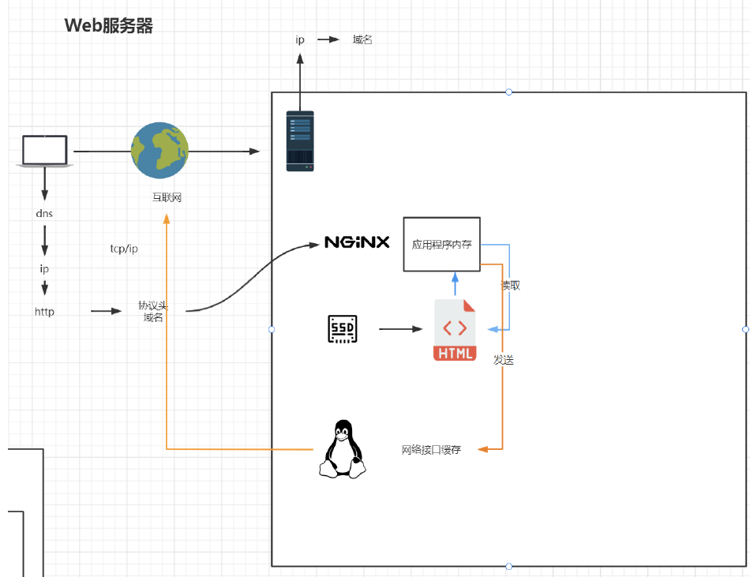
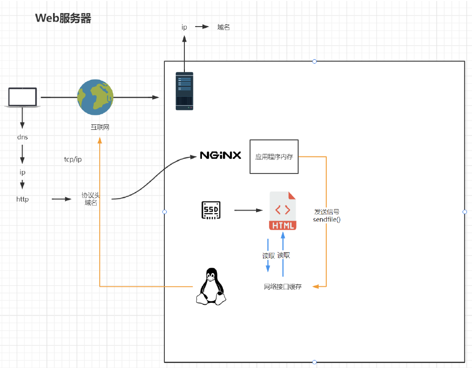

# 配置与应用场景

## 1 最小配置

- worker_processes：默认为1，表示开启一个业务进程

  ```nginx
  worker_processes 1;
  ```

  - 一般要小于等于CPU内核数

- worker_connections：单个业务进程可接受连接数

  ```nginx
  events {
      worker_connections  1024;
  }
  ```

- `http`模块

  ```nginx
  http {
      # ...
  }
  ```

  - `include mime.types;`：引入http mime类型。说明**后缀名**与**解析方式**的对应关系。

    ```nginx
    types {
        text/html                                        html htm shtml;
        text/css                                         css;
        text/xml                                         xml;
        image/gif                                        gif;
        # ...
        application/octet-stream                         bin exe dll;
    	# ...
    }
    ```

    > 比如告诉浏览器用`video/mp4`的方式解析`.xxx`，就可以加一行：
    >
    > ```nginx
    > video/mp4            xxx
    > ```

  - `default_type application/octet-stream;`：如果mime类型没匹配上，默认使用二进制流的方式传输。

  - `sendfile on;`：使用`linux`的`sendfile(socket, file, len)`高效网络传输，也就是数据0拷贝。

    - 不开启：

      

      > 多了一次在应用程序内存中读取和发送的过程

    - 开启：

      

      > 推送一个信号给网络接口，让网络接口读即可

  - `keepalive_timeout 65;`（后面会仔细讲）

  - `server`模块：虚拟主机（可以配置多个）

    ```nginx
    server {
        listen 80; # 监听端口号
            server_name localhost; # 域名、主机名
            location / { # 匹配URI路径（重点内容，后面会仔细讲）
                root html; # 文件根目录，相对于nginx主目录的路径
                index index.html index.htm; # 默认页名称
        }
        error_page 500 502 503 504 /50x.html; # 报错编码对应页面
        location = /50x.html { # 又把/50x.html指定的html目录 
            root html;
        }
    }
    ```

    

    


## 2 虚拟主机


## 3 反向代理与负载均衡
